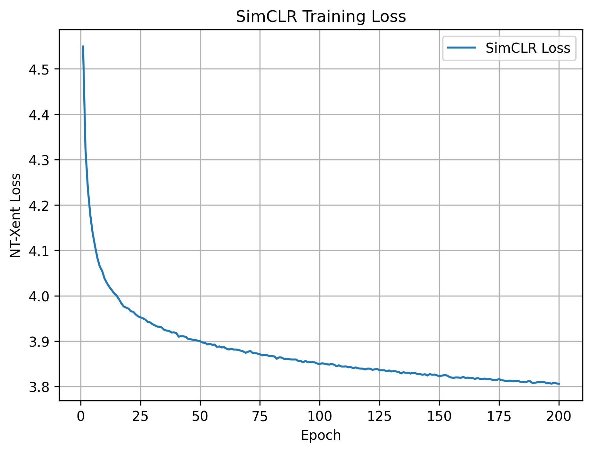
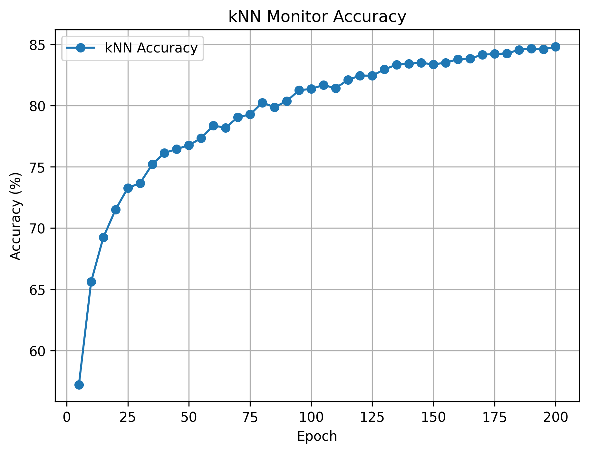

# Self-Supervised Representation Learning with SimCLR

This repository provides a clean and reproducible implementation of **SimCLR**, a self-supervised contrastive learning framework for visual representation learning. The project focuses on learning transferable image representations without labels and evaluating them using kNN monitoring, linear probing, and comparison with supervised training.

The implementation is designed to reflect research-level experimental practice rather than a coursework-only submission.

---

## Motivation

In many computer vision applications such as **pattern recognition** and **image segmentation**, acquiring large-scale labeled datasets is expensive and time-consuming. Self-supervised learning addresses this challenge by learning meaningful representations directly from unlabeled data.

This project investigates whether contrastive self-supervised learning can produce representations that are competitive with, or superior to, those learned via supervised training from scratch.

---

## Method Overview

- **Backbone:** Modified ResNet-18 (CIFAR-10 compatible)
- **Self-Supervised Method:** SimCLR
- **Loss Function:** NT-Xent
- **Dataset:** CIFAR-10
- **Evaluation:**
  - k-Nearest-Neighbor (kNN) monitoring
  - Linear probing on frozen representations
  - Fully supervised baseline comparison

All models are trained **from scratch**, without pretrained weights.

---

## Experimental Results

| Model                               | Test Accuracy (%) |
|------------------------------------|-------------------|
| Random Initialization + Linear     | ~10               |
| **SimCLR + Linear Probing**         | **86.93**         |
| **Supervised Training (from scratch)** | **84.17**     |

Self-supervised contrastive learning produces more transferable representations than supervised training under identical conditions.

---

## Training Dynamics

### SimCLR Training Loss


### kNN Monitor Accuracy


---

## Repository Structure

```text
simclr-representation-learning/
├── datasets/     # Data loading and augmentations
├── models/       # Backbone and projection head
├── losses/       # Contrastive loss
├── training/     # Training scripts
├── utils/        # Evaluation and visualization
├── outputs/      # Logs and plots
└── report/       # Final report
```
---

## How to Run

### Install dependencies
```bash
pip install -r requirements.txt
```
Train SimCLR (self-supervised pretraining)
```Shell
python training/train_simclr.py
```
Linear Probing (representation evaluation)
```Shell
python training/train_linear_probe.py
```
Supervised Baseline
```Shell
python training/train_supervised.py
```

## References

- Chen, T., Kornblith, S., Norouzi, M., and Hinton, G.,  
  *A Simple Framework for Contrastive Learning of Visual Representations*,  
  ICML, 2020.

- Krizhevsky, A. and Hinton, G.,  
  *Learning Multiple Layers of Features from Tiny Images*,  
  University of Toronto, 2009.

- He, K., Zhang, X., Ren, S., and Sun, J.,  
  *Deep Residual Learning for Image Recognition*,  
  CVPR, 2016.

- Paszke, A. et al.,  
  *PyTorch: An Imperative Style, High‑Performance Deep Learning Library*,  
  NeurIPS, 2019.

---
